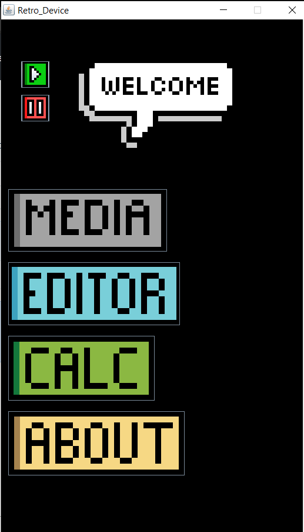
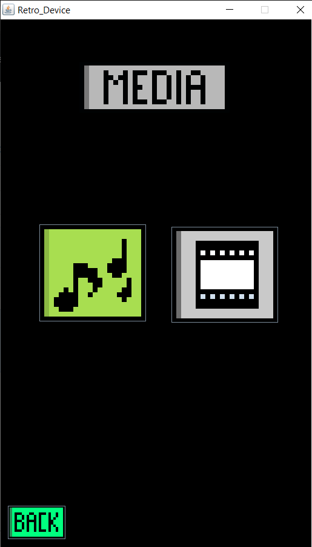
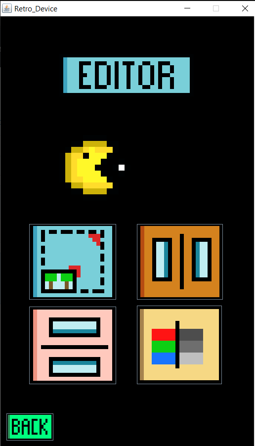
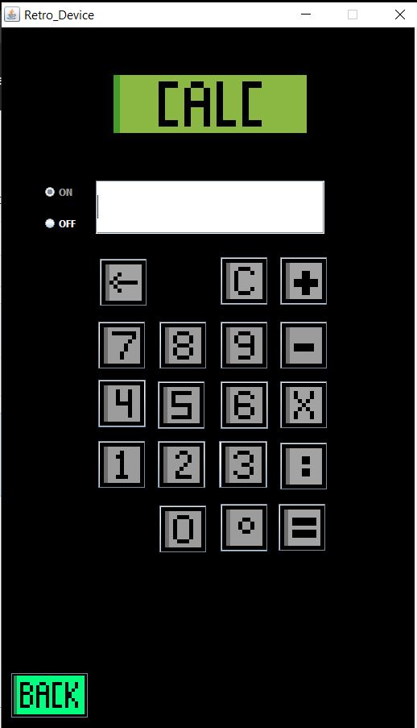

# MPF
This is my college final project for Multimedia Programming Foundation

## About the Program
This is a simple program where the user can play media such music and video, editing simple picture, and calculator

## What I've Learned
Using Java language for making simple animation, calculation, GUI, and panels

##Info
For easiest editing or make changes the program, I recommend using NetBeans-IDE 8.2

## Screenshot of Program
#### Main Screen

#### Media Screen

#### Edit Screen

#### Calc Screen

